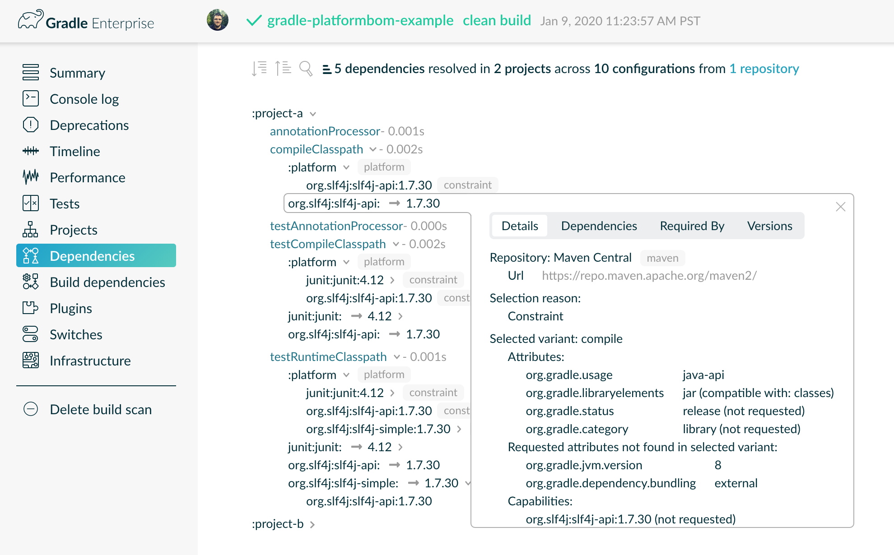

# gradle-platformbom-example
Example of how to use a BOM in [Gradle](https://www.gradle.org) to share dependency versions across projects.

## Project Structure
This example contains the following projects:

- [platform](platform) - The BOM project that defines the shared dependencies.
- [project-a](project-a) - A project that uses the platform BOM.
- [project-b](project-b) - A project that uses the platform BOM.

## Building the Example
Run the following command to build the example and create a Gradle Build Scan:

    ./gradlew clean build --scan
    
If successful, you will see that your build published a build scan:

    BUILD SUCCESSFUL in 1s
    11 actionable tasks: 10 executed, 1 up-to-date
    
    Publishing build scan...
    https://gradle.com/s/o4xloi6jkmnck
        
This build's build scan can be found at: [https://gradle.com/s/o4xloi6jkmnck](https://gradle.com/s/o4xloi6jkmnck)

## Gradle Build Scan
Use the Gradle Build Scan created by your build to check out the dependency resolution.

1. Navigate to the build scan URL in a web browser.

2. Select the `Dependencies` tab in the right-hand menu.

3. Notice in the image below that the `platform` dependencies have been included as constraints and the `slf4j-api` dependency's selection reason is `Constraint`.

    

## Bugs and Feedback
For bugs, questions, and discussions please use the [Github Issues](https://github.com/gregwhitaker/gradle-platformbom-example/issues).

## License
MIT License

Copyright (c) 2020 Greg Whitaker

Permission is hereby granted, free of charge, to any person obtaining a copy
of this software and associated documentation files (the "Software"), to deal
in the Software without restriction, including without limitation the rights
to use, copy, modify, merge, publish, distribute, sublicense, and/or sell
copies of the Software, and to permit persons to whom the Software is
furnished to do so, subject to the following conditions:

The above copyright notice and this permission notice shall be included in all
copies or substantial portions of the Software.

THE SOFTWARE IS PROVIDED "AS IS", WITHOUT WARRANTY OF ANY KIND, EXPRESS OR
IMPLIED, INCLUDING BUT NOT LIMITED TO THE WARRANTIES OF MERCHANTABILITY,
FITNESS FOR A PARTICULAR PURPOSE AND NONINFRINGEMENT. IN NO EVENT SHALL THE
AUTHORS OR COPYRIGHT HOLDERS BE LIABLE FOR ANY CLAIM, DAMAGES OR OTHER
LIABILITY, WHETHER IN AN ACTION OF CONTRACT, TORT OR OTHERWISE, ARISING FROM,
OUT OF OR IN CONNECTION WITH THE SOFTWARE OR THE USE OR OTHER DEALINGS IN THE
SOFTWARE.